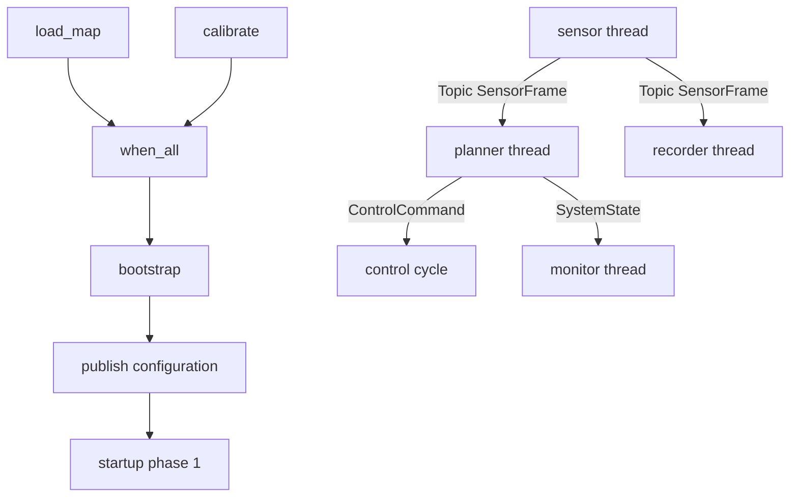

# Complete Robot Pipeline

The preceding tutorials explained submission, dependencies, and passing values across threads. A real system combines those choices and defines ownership, capacity, failure, and shutdown semantics for every edge. This page follows the repository's `comm_robot_pipeline` example.

## What we are building



Completion dependencies use Kairo tasks and `TaskHandle`; continuous frame, configuration, command, and status flow uses `kairo::comm`. Neither model substitutes for the other.

## Define data ownership first

| Data | Producer | Consumer | Ownership model |
| --- | --- | --- | --- |
| `SensorFrame` | Sensor thread | Planner and recorder | Topic copies into two independent bounded FIFOs |
| `ControlConfig` | Bootstrap/config owner | Planner/control | Mailbox retains the newest value; readers copy it |
| `ControlCommand` | Planner thread | Control cycle | Value enters a bounded real-time channel; each cycle consumes a budget |
| `SystemState` | Planner thread | Monitor | Writer publishes a complete object; reader receives a snapshot copy |
| Startup phase | Bootstrap | Long-running roles | Monotonic phase number, not business data |

The example types are small, so value transfer makes lifetime clear. Large images, point clouds, and models need an explicitly owned buffer handle, capacity, return timing, and post-close release responsibility.

## Choose a component per edge

`Topic<SensorFrame>` fans each subsequent frame out to independent planner and recorder subscriptions. The planner has capacity 16 with `RejectNewest`; the intentionally slow recorder has capacity 2 with `KeepLatest`. Its overwrites do not roll back planner delivery. `TopicPublishResult` reports matched, delivered, and rejected subscribers, while each subscription exposes its own statistics. Topic has no replay and is not reliable, atomic across subscribers, networked, or hard real-time. Use `Topic<std::shared_ptr<const T>>` explicitly for large immutable payloads.

`LatestMailbox<ControlConfig>` makes overwritten old settings intentional. Long-lived consumers keep `last_seen`, apply only newer sequences, and define behavior before any configuration arrives.

`RealtimeChannel<ControlCommand>` protects cycle length by bounding `drain_for_cycle()`. Producers must observe failed sends, depth, lag, and command age. If only the latest command matters, FIFO may be the wrong model: use a mailbox or merge commands at the application layer.

`DoubleBuffer<SystemState>` gives monitors a consistent snapshot, not every intermediate update. The planner is its sole writer; coordinate first if several modules produce state. `PhaseGate` represents monotonic startup stages and does not carry configuration or roll back.

## Startup dependency

```cpp
auto load_map = executor.submit_with_handle(load_map_task);
auto calibrate = executor.submit_with_handle(calibrate_task);
auto prerequisites = executor.when_all({load_map.handle, calibrate.handle});
auto bootstrap = executor.submit_after(prerequisites, start_pipeline);
```

Consume `bootstrap.get()`. If a prerequisite fails, close the gate/channels and wake waiting roles for cleanup; do not merely leave threads waiting for phase advancement. Submit prerequisites before the dependent and limit in-flight chains because dependent wrappers can wait in the pool.

## Build and run

```bash
cmake -B build -DCMAKE_BUILD_TYPE=Release \
  -DKAIRO_BUILD_EXAMPLES=ON \
  -DKAIRO_ENABLE_GPU=OFF
cmake --build build --target comm_robot_pipeline
./build/examples/comm_robot_pipeline
```

Full source: [`examples/comm_robot_pipeline.cpp`](https://github.com/Linductor-alkaid/kairo/blob/master/examples/comm_robot_pipeline.cpp).

Thread output and timing vary. Verify that bootstrap reports both prerequisites, the planner receives all eight frames, accepted commands are eventually processed, and joined threads exit normally. The slow recorder may report its own `Overwritten` events without changing planner delivery. An initial `StaleRead` before the first state snapshot is expected; it is not corruption.

## What this example does not prove

The `realtime_thread` is a portable `std::thread + sleep_for(1ms)` simulation, not a real-time performance claim. It does not validate priority, affinity, memory locking, timer slack, or jitter. Replace it with the dedicated real-time Facade for deployment, retain bounded channel consumption, then validate `RealtimeExecutorStatus` on target hardware.

The compact example also omits full startup-failure handling, sustained subscriber overload, command rejection, and exception boundaries. It naturally ends after eight frames; a long-running service needs an explicit stop signal, Topic close owner, and time budgets.

## Failure injection and shutdown

Slow one Topic subscriber with capacity `1`; fail `load_map`; lower control consumption while increasing command production; pause the monitor; and publish while unsubscribing. Each experiment must produce an intentional rejection/overwrite/backoff/statistic instead of a silent hang or access to destroyed subscription state.

Recommended order: stop external start/config requests; stop the sensor owner; close `sensor_frames`; let planner and recorder drain; stop and drain commands; stop real-time work; let monitor read the final snapshot; close gates/channels to wake waiters; bounded-wait ordinary tasks; shutdown Kairo; then destroy communication objects and business state.

An architecture review should identify each one-time task, long-running role, real-time need, data-loss/overwrite policy, component owner, failure observation path, overload boundary, and the shutdown lifetime of every captured object. For specialist constraints, continue with [Real-Time and Communication](/en/realtime-and-communication/) only after the required result model is explicit.
