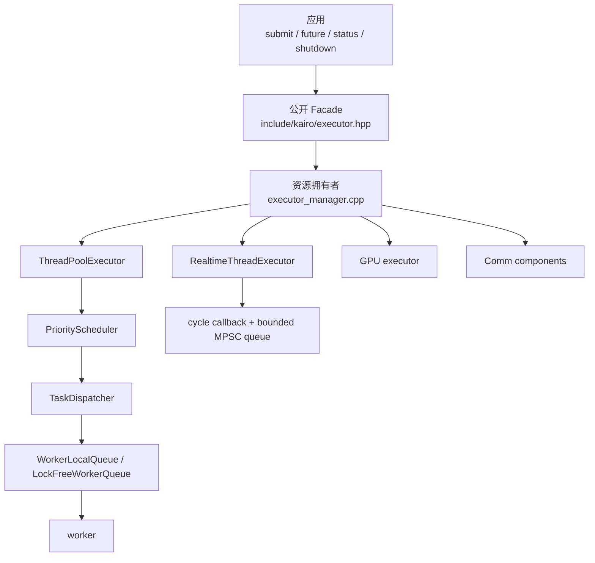
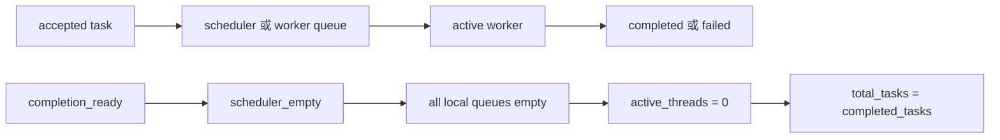
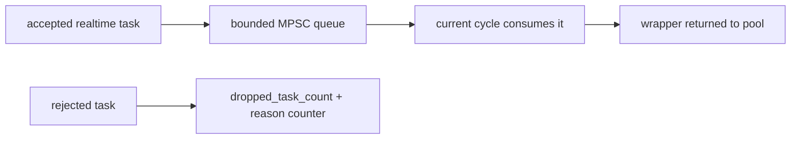

# 源码结构与阅读路线

## 这页解决什么问题

当你需要判断一个行为究竟来自 Facade、线程池、任务图还是平台层时，不要从所有头文件开始浏览。Kairo 的源码按“公开契约、资源拥有者、执行路径、诊断路径”分层；先找到边界，再追一条任务的生命周期，效率最高。

这页描述当前源码组织。`include/kairo/` 中的 Facade 和类型是用户可依赖入口；`src/kairo/` 中的调度器、队列和同步实现可能重构，但其外部可观察行为应由测试和状态 API 固定。

## 四层结构

每层只应承担自己的责任：

| 层 | 主要责任 | 不应承担 |
| --- | --- | --- |
| Facade | 将用户调用转成可观察的 future、handle 和失败事件 | 直接管理 worker 队列或假设某种锁实现 |
| Manager | 拥有执行器实例、处理单例/独立实例和注册生命周期 | 替用户决定业务重试或数据幂等 |
| Adapter | 将 `IAsyncExecutor`/`IRealtimeExecutor` 映射到具体实现 | 修改 Facade 的业务语义 |
| Scheduler/queue | 排队、分发、消费和背压 | 保存跨任务的业务状态 |
| Monitor/diagnostics | 统计和报告 | 在回调中阻塞或改变任务结果 |

## 从 API 反查源码

| 你看到的行为 | 首先读 | 然后读 | 验证证据 |
| --- | --- | --- | --- |
| `submit_auto(lambda)` 返回 future | `include/kairo/executor.hpp` 的路由和模板 API | `src/kairo/thread_pool_executor.cpp`、`thread_pool.cpp` | Facade/routing、异常和超时测试 |
| 依赖任务未执行 | Facade 的 `TaskGraphState` 和 `submit_after_with_handle` | `src/kairo/task/task_dependency_manager.cpp` | `tests/test_executor_facade*`、依赖教程 smoke |
| 优先级没有抢占 | `PriorityScheduler::dequeue()` | `TaskDispatcher::dispatch()`、worker loop | 优先级测试和队列状态 |
| resize 后任务没有丢失 | `ThreadPool::resize_local_queues()` | `TaskDispatcher::dispatch_batch()` 回入队分支 | resize/并发停止测试 |
| 实时任务 drop | `Executor::push_realtime_task()` | `RealtimeThreadExecutor::push_task()` | realtime push overflow 测试、状态计数 |
| 无锁队列“偶发空/满” | `src/kairo/util/lockfree_queue.hpp` | 调用方的容量和对象池逻辑 | MPSC benchmark、TSAN/压力测试 |

源码阅读时先找“谁拥有对象”和“谁能让它退出”：`Executor` 拥有实例化模式的 Manager，Manager 拥有执行器，Adapter 用 `shared_ptr` 快照保护 stop/submit 竞争；实时 `cycle_manager` 则由调用方拥有，Kairo 只借用指针。

## 同步域不是一把全局锁

当前实现有多个相互独立的同步域：

| 同步域 | 保护对象 | 典型锁/原子 | 设计原因 |
| --- | --- | --- | --- |
| Facade failure | 失败计数、ring buffer、callback 快照 | `failure_mutex_` | callback 在解锁后执行，避免诊断回调重入内部锁 |
| Facade task graph | 节点状态、dependents 映射 | `task_graph_mutex_` + graph manager `shared_mutex` | 状态转移与依赖解析必须原子观察 |
| Manager registry | realtime/GPU 注册表 | `shared_mutex` | 查询多、注册少；Facade 通过 `shared_ptr` 快照持有对象，裸指针高级接口需自行与 shutdown 串行化 |
| ThreadPool lifecycle | stop、total/completed/active | `mutex_` + atomic counters | 提交停止边界与等待完成条件分离，避免锁顺序反转 |
| local queues | worker queue vector 的替换 | `local_queues_mutex_` + atomic `shared_ptr` | resize 时旧 vector 由快照延长生命周期 |
| LockFreeQueue slots | 槽位就绪和回收序列 | `sequences_` acquire/release | 数据发布与槽位复用需要顺序关系，不用 mutex 串行化生产者 |

不要把“使用了 atomic”理解成“没有锁”，也不要为了消除一把锁而跨越同步域读写对象。修改源码前先画出：谁写、谁读、对象何时销毁、哪个条件变量负责唤醒。

## 两条完成不变量

普通执行路径依赖两个计数事实：

`failed_tasks` 是 `completed_tasks` 的子集，不能再从完成等式中扣除。任务从 scheduler 出队后，如果 worker ID 失效或本地队列满，dispatcher 必须把任务重新放回 scheduler；否则会出现“提交成功但永远没有 future 结果”的丢失窗口。

实时路径的对应不变量是：

停止时先禁止新 producer，再等待已登记 producer 退出，最后 drain 队列；这保证最终 drain 后不会凭空出现一个“已接受但未清理”的 wrapper。

## 修改源码时的验证顺序

1. 先写能暴露不变量破坏的最小测试：future 是否就绪、计数是否对账、关闭是否有界。
2. 再运行对应局部测试：任务图改动看依赖/Facade 测试，队列改动看 MPSC/实时 overflow，resize 改动看 resize 与并发停止。
3. 用状态 API 和 failure event 验证用户可见路径，而不只断言内部变量。
4. 最后运行 TSAN 或压力测试；并发代码“本地单次通过”不能证明没有竞态。
5. 如果改动性能，按[性能测量与回归检查](/zh/advanced/performance-measurement)保存环境、原始 JSON 和正确性对账。

## 继续阅读

- [任务如何穿过执行器](/zh/advanced/execution-paths)：沿一条普通任务和实时任务追踪具体状态转移。
- [无锁与性能实验](/zh/advanced/lockfree-and-performance)：理解 MPSC 槽位序列、对象池和“无锁”的真实范围。
- [接入自定义周期源](/zh/advanced/custom-cycle-manager)：理解外部时钟如何接管实时线程的触发与停止。
- [性能测量与回归检查](/zh/advanced/performance-measurement)：把源码修改转成可复现的性能结论。
