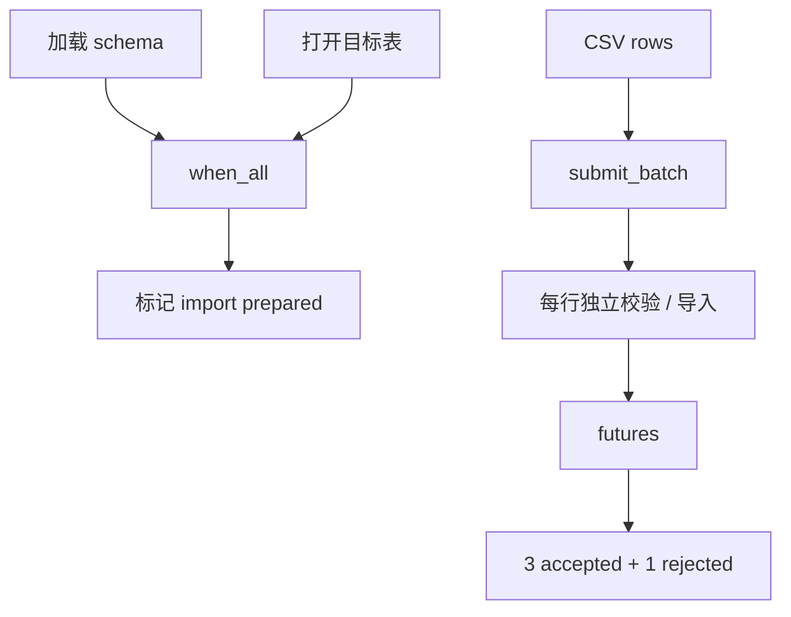
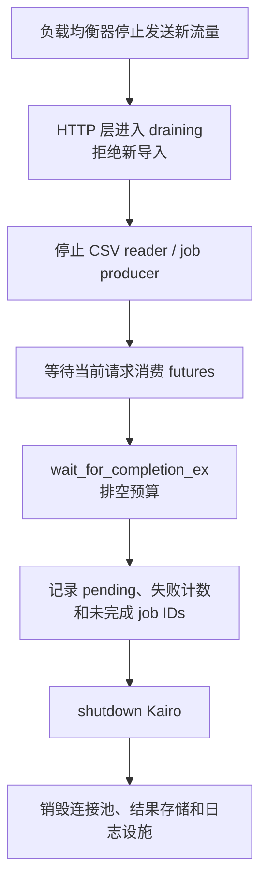

# 服务端数据导入案例

Kairo 的任务模型不只适用于机器人。本页用一个常见的服务端请求验证同一套思路：导入一批 CSV 订单前，服务需要并行加载 schema 和打开目标表；准备完成后并行校验四行数据，其中一行非法；请求返回成功数和拒绝数，服务关闭前还要确认没有遗留工作。

这个示例不连接真实数据库，避免外部依赖影响 smoke test。它演示的是并发与失败协议；真实写入还必须补充事务、幂等键和连接池容量。

## 请求如何分阶段



这里有两种不同关系：

- schema 与目标表都准备好，导入才能开始，这是一次性的**完成依赖**；
- 四行记录相互独立，可以组成一个**批次**，但每行仍有自己的成功或异常结果。

不能因为它们属于同一批次，就假设具有数据库事务语义。普通 batch 不会在一项失败时回滚其他已完成项。

## 可运行示例

<<< @/../examples/tutorial/10_service_data_import.cpp{1-77}

完整源码：[`examples/tutorial/10_service_data_import.cpp`](https://github.com/Linductor-alkaid/kairo/blob/master/examples/tutorial/10_service_data_import.cpp)。

```bash
cmake -B build -DCMAKE_BUILD_TYPE=Release \
  -DKAIRO_BUILD_TESTS=ON \
  -DKAIRO_BUILD_EXAMPLES=ON \
  -DKAIRO_ENABLE_GPU=OFF
cmake --build build --target tutorial_10_service_data_import
./build/examples/tutorial/tutorial_10_service_data_import
```

## 预期输出

```text
prepared=yes, schema=schema-v1, table=orders
imported=3, rejected=1, callbacks=1, drained=yes
```

输出没有线程 ID、计时或完成顺序，因此适合 smoke test。稳定事实是准备阶段成功、三行有效、一行非法、任务异常被 callback 观察一次，并且默认异步执行器最终排空。

## 第一步：准备依赖

schema 和目标表可以并行准备，但必须全部成功：

```cpp
auto schema = executor.submit_with_handle(load_schema);
auto destination = executor.submit_with_handle(open_table);
auto prerequisites = executor.when_all({schema.handle, destination.handle});
auto prepared = executor.submit_after(prerequisites, mark_prepared);
```

`TaskHandle` 只表达完成关系，实际的 `schema-v1` 和 `orders` 仍从各自 future 取回。调用方同时拥有 handles 和 futures，直到 `prepared.get()` 结束；不要把它们跨 Kairo 实例或跨请求生命周期保存。

如果 schema 失败，dependent 不应运行，其 future 会传播前置失败。服务应在请求边界把它转换成明确的 4xx/5xx 或重试结果，而不是继续提交数据行。

## 第二步：建立独立批次

示例把每个字符串按值捕获进任务，因此原始 `rows` 容器即使之后改变，也不会让任务引用悬空：

```cpp
for (const auto& row : rows) {
    imports.push_back([row, &imported] {
        validate_and_import(row);
        ++imported;
    });
}
auto futures = executor.submit_batch(imports);
```

共享计数器使用原子类型，并且活到所有 futures 完成。真实导入不要让多个任务无保护地修改同一个请求结果对象；可以让每个 future 返回自己的 `RowResult`，再由请求线程统一汇总。

### 为什么本例允许部分成功

四行记录在业务上独立，一行缺少订单 ID 不影响其他三行校验，因此调用方遍历全部 futures：

```cpp
for (auto& future : futures) {
    try {
        future.get();
    } catch (const std::exception&) {
        ++rejected;
    }
}
```

不能在第一个异常处直接退出循环，否则其余 futures 的结果和异常无人消费。需要“全有或全无”时，应在任务阶段只做解析与校验，全部成功后再由数据库事务统一提交；Kairo batch 本身不提供 rollback。

## 第三步：区分请求结果与服务观测

逐项 future 回答“这行成功了吗”；failure callback 回答“服务刚发生了什么任务异常”。示例同时使用两者不是重复计数，而是展示两个责任层：

| 观察入口 | 使用者 | 回答的问题 |
| --- | --- | --- |
| 每行 future | 当前导入请求 | 哪一行成功或失败，应该返回什么结果 |
| failure callback | 日志/告警适配层 | 服务是否出现任务异常趋势 |
| failure status | 健康检查/仪表盘 | 某类失败累计多少 |
| `WaitResult` | 生命周期 owner | 停止时还有多少 active/queued 工作 |

callback 应保持短小、非阻塞。生产中不要在 worker 失败路径同步调用远端告警 API；把事件转交给自己的日志或遥测队列。

## 输入规模与容量假设

示例只有四行、两个 worker 和容量 `32`，目的是稳定验证部分失败，不是推荐生产参数。真实 CSV 可能有百万行，不能一次为每行创建任务和 future：

1. 以固定行数或字节数分块读取。
2. 限制同时在途的批次数量。
3. 每批完成后释放输入 buffer 和 futures。
4. 根据数据库连接池限制并发写入，而不是按 CPU 数无限放大 worker。
5. 记录排队时间、批次年龄、拒绝数和端到端吞吐。

当任务主要等待数据库时，提高线程数可能把瓶颈转移为连接池争抢和数据库过载。容量预算必须覆盖 Kairo 队列、输入 buffer、连接池和下游写入能力整条链路。

## 真实写入需要额外协议

### 幂等性

任务可能在调用方超时后继续完成，应用也可能重试整个批次。每行写入应使用订单 ID 或导入 ID 作为幂等键，避免重试产生重复记录。

### 事务

如果一行失败必须回滚全部行，不要让每个 worker 独立提交数据库事务。先并行解析/校验，汇总成功后在受控事务边界写入，或使用数据库支持的 staging table 与原子切换。

### 取消

`wait_for_completion_ex()` 超时不会强制终止正在执行的数据库调用。为连接和语句设置超时，让长批次检查业务 deadline；请求取消后还要决定已经提交的副作用是否保留。

### 结果保留

HTTP 请求可能在后台工作完成前断开。需要异步导入时，为任务分配持久化 job ID，把进度和行错误写入外部存储；不能只把 futures 留在请求栈上。

## 故障注入

### schema 加载失败

让 schema task 抛异常。预期 prepared future 失败，数据批次完全不提交；请求返回准备阶段错误。

### 单行格式错误

保持示例中的空订单 ID。预期其他三行仍成功，失败 future 与 callback 都可观察，但总计不能重复把同一错误算成两条业务失败。

### 数据库变慢

给每行任务增加有界延迟，并缩短请求等待预算。预期请求能报告超时，任务可能仍在运行；连接级超时与幂等协议决定之后如何安全收尾。

### 服务开始 draining

在接受批次前检查服务状态。进入 draining 后拒绝新导入，等待已接受批次并记录 `pending_tasks`；不要先 shutdown Kairo，再让 HTTP handler 继续提交。

## 退出顺序



如果使用独立 Kairo 管理导入子系统，重启时应重建整个子系统；已 shutdown 的实例不能重新初始化。

## 需求变化时如何演进

| 新需求 | 演进方式 |
| --- | --- |
| 文件很大 | 流式分块 + 限制在途批次，不一次创建全部 futures |
| 必须全有或全无 | 并行校验后进入数据库事务，不依赖 batch rollback |
| 允许后台执行 | 持久化 job ID、状态和错误，HTTP 返回 `202 Accepted` |
| 失败行可重试 | 为每行建立幂等键、重试上限和 dead-letter 记录 |
| 多租户共享执行器 | 每租户限流与公平性策略，避免一个大文件占满 worker |
| 导入顺序影响结果 | 按 key 分区串行或建立显式依赖，不使用完成时序碰运气 |

这个案例验证了与机器人流水线相同的核心原则：先定义任务关系和数据所有权，再选择 API；future 负责单次结果，callback/status 负责服务观测；最后由应用定义过载、幂等和退出。回顾[批量教程](/zh/tutorial/batch)可查看接口细节，准备上线时使用[生产接入检查清单](/zh/guides/production-readiness)。
